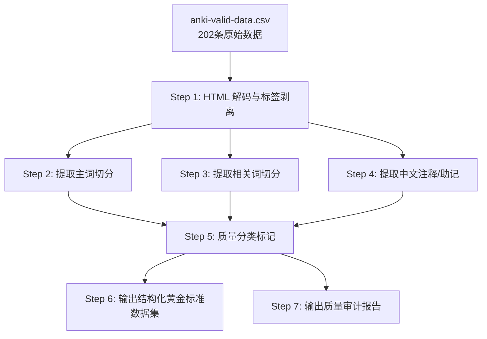

# Anki 有效数据清洗方案 — 构建词根词缀切分黄金标准数据集

## 背景

[`plains/anki-valid-data.csv`](plains/anki-valid-data.csv) 是从 Anki 数据库中提取的 202 条有效数据，包含单词及其人工标注的**词根词缀切分信息**。当前数据质量参差不齐，混有 HTML 标签、HTML 实体、中文注释、联想助记等多种非结构化内容，无法直接用于自动化测试。

## 目标

将该 CSV 清洗为结构化的**黄金标准数据集**，用于：

1. **检验自动切分引擎（轨道 A）**：给定单词，验证程序输出的切分结果是否与人工切分一致
2. **检验形似词联想引擎（轨道 B）**：给定单词，验证程序能否召回数据中标注的相关词
3. **提炼词根词缀规则**：从人工切分中抽取前缀、后缀、词根模式

---

## 数据现状分析

### CSV 结构

| 列名 | 说明 | 现状 |
|------|------|------|
| `word` | 单词 | 基本干净，偶有空格问题 |
| `segmentation` | 切分数据（原始 Anki 第6项） | **极其脏**，混合 HTML/中文/切分/相关词 |

### segmentation 字段的 8 类脏数据问题

| 类别 | 示例（行号） | 问题描述 |
|------|-------------|---------|
| **① HTML 标签** | L2 `<br>` L4 `<div>...</div>` | `<br>`, `<div>`, `<span>`, `<font>` 等标签混入 |
| **② HTML 实体** | L4 `&nbsp;` L66 `&gt;` | `&nbsp;`, `>`, `<`, `"` |
| **③ HTML 样式属性** | L102 `style="background-color: rgb(254, 253, 235);"` | 内联 CSS 样式 |
| **④ 中文注释** | L2 `sovereign 形容词` L6 `蹭（吃、喝）` | 中文解释混在切分数据中 |
| **⑤ "联想" 类条目** | L19 `联想：用skill.et做小炒是需要skill的` | 非真实词根切分，属于助记法 |
| **⑥ 多重切分** | L4 `coll.eg.i.al` + `coll.eg.i.ate` | 主词切分 + 相关词切分混在一起 |
| **⑦ 纯注释无切分** | L40 `看上去像个复数形式` | 第6项有内容但无点号切分词 |
| **⑧ HTML 彩色字体** | L137 `<font color="#ff5000">` | 带颜色的 HTML 标签 |

> 说明：实际 CSV 中 `<` `>` 已经是 HTML 编码后的 `<` `>`，但文件内容用 `&lt;` 编码为 XML-safe 形式。

---

## 清洗方案

### 总体架构



### Step 1: HTML 解码与标签剥离

**输入样例**（L2）：
```
sover.eign.ty<br>sover -> (vulgar latin) super<br>sovereign 形容词
```

**处理流程**：
1. 解码 HTML 实体：`&nbsp;` → ` `, `&gt;` → `>`, `&lt;` → `<`, `&quot;` → `"`
2. 剥离所有 HTML 标签：`<br>`, `<div>...</div>`, `<span ...>...</span>`, `<font ...>...</font>`
3. 规范化空白：多个空格 → 一个空格，去除首尾空白

**输出**：
```
sover.eign.ty sover -> (vulgar latin) super sovereign 形容词
```

### Step 2: 提取主词切分

核心逻辑：从剥离后的文本中，找到**第一个**与 `word` 列匹配的带点号切分词。

**匹配规则**：
1. 用正则 `[a-zA-Z]+(?:\.[a-zA-Z]+)+` 提取所有带点号单词
2. 去点后与 `word`（小写）比较
3. 匹配到的第一个即为主词切分
4. 如果无匹配 → 标记为 `segment_type = "no_segmentation"`（如 L40）

**示例**：
| word | 剥离后文本 | 提取结果 |
|------|-----------|---------|
| sovereignty | `sover.eign.ty sover -> ...` | `sover.eign.ty` |
| collegial | `coll.eg.i.al ... coll.eg.i.ate` | `coll.eg.i.al` |
| auspices | `au.spic.es 看上去像个复数形式` | `au.spic.es` |

### Step 3: 提取相关词切分

从剥离后的文本中，提取**所有**带点号切分词，排除主词切分。

**输出格式**：逗号分隔的 `seg:word` 对

**示例**：

| word | 剥离后文本 | 相关词提取 |
|------|-----------|-----------|
| collegial | `coll.eg.i.al ... coll.eg.i.ate` | `coll.eg.i.ate` |
| roadster | `road.ster drag.ster 短程高速赛车` | `drag.ster` |
| calamitous | `calam.it.ous calam.it.y ... cata.strophe ...` | `calam.it.y, calam.os, cata.strophe, cataclysm, apocalypse` |

### Step 4: 提取中文注释/助记

从剥离后的文本中提取：
- **中文解释**：连续中文字符（用于理解切分逻辑）
- **英文说明**：非切分的英文单词、词源说明等
- **助记标记**：是否以 `联想：` 开头

### Step 5: 质量分类标记

每条数据标记一个 `segment_type`：

> **注意**："联想"等助记标记**不影响数据质量**。只要有点号切分且去点后匹配 word，即为已验证切分。相关词列表是用户人工联想的成果，是轨道 B 的核心测试数据。

| 类型 | 标签 | 判定条件 |
|------|------|---------|
| ✅ **已验证切分** | `verified` | 主词切分存在，去点后匹配 word |
| 🔴 **无切分** | `no_seg` | 无带点号切分词（预期极少或不存在） |

### Step 6: 输出黄金标准数据集格式

**主文件**：[`plains/gold-standard.csv`](plains/gold-standard.csv)

```csv
word,segmentation,segment_type,related_words,notes
sovereignty,sover.eign.ty,verified,"",sover -> (vulgar latin) super; sovereign
roadster,road.ster,verified,"drag.ster",
collegial,coll.eg.i.al,verified,"coll.eg.i.ate",学院的；与同僚共同分担责任的
tentative,tenta.tive,verified,"tenta.cle",试探性的
scoundrel,scoun.drel,verified,"scrounge",
calamitous,calam.it.ous,verified,"calam.it.y; calam.os; cata.strophe; cataclysm; apocalypse",
skillet,skill.et,verified,"",用skill.et做小炒是需要skill的 联想
```

**辅助文件**：单独提取的**相关词映射表** [`plains/related-words.csv`](plains/related-words.csv)

```csv
source_word,source_seg,related_word,related_seg
roadster,road.ster,drag.ster,drag.ster
collegial,coll.eg.i.al,coll.eg.i.ate,coll.eg.i.ate
tentative,tenta.tive,tenta.cle,tenta.cle
calamitous,calam.it.ous,calam.it.y,calam.it.y
```

### Step 7: 输出质量审计报告

输出 [`plains/cleaning-audit-report.md`](plains/cleaning-audit-report.md)，包含：
- 总条目数 / 各质量类型的分布
- 提取到的相关词总数 / 唯一相关词数
- 无切分条目清单
- 助记类条目清单
- 统计摘要

### 技术实现

使用 Python 标准库实现，无需第三方依赖：

| 功能 | 库/模块 |
|------|--------|
| HTML 实体解码 | `html.unescape()` |
| HTML 标签剥离 | `re.sub(r'<[^>]+>', '', text)` |
| 中文检测 | `re.compile(r'[\u4e00-\u9fff]+')` |
| 点号切分提取 | `re.compile(r'[a-zA-Z]+(?:\.[a-zA-Z]+)+')` |
| CSV 读写 | `csv.DictReader` / `csv.DictWriter` |

### 执行命令

```bash
.\venv\Scripts\python.exe clean_anki_data.py
```

---

## 清洗后的数据如何使用

### 用于检验自动切分引擎（轨道 A）

```
gold-standard.csv 中的 (word, segmentation) 对
     ↓
输入 word → 自动切分引擎 → 输出 predicted_segmentation
     ↓
比较 predicted_segmentation == segmentation ?
     ↓
计算准确率: 匹配数 / 总已验证条目数
```

### 用于检验形似词联想引擎（轨道 B）

```
related-words.csv 中的 (source_word, related_word) 对
     ↓
输入 source_word → 联想引擎 → 输出 suggested_words 列表
     ↓
检查 suggested_words 是否包含 related_word
     ↓
计算召回率: 命中数 / 总相关词对数
```

### 用于提炼词根词缀规则

从所有 `verified` 类型条目的 `segmentation` 中：
- 提取第一部分（前缀）：点号前的第一个片段
- 提取最后一部分（后缀）：点号后的最后一个片段
- 提取中间部分（词根）：中间片段集合

---

## 风险与注意事项

1. **HTML 双重编码**：CSV 中 `&nbsp;` 是 `&nbsp;` 的 HTML 编码，需要先 `html.unescape()` 两次
2. **大小写保留**：部分单词（如 L145 `Pharisee`）首字母大写，切分时应保留原始大小写
3. **点号在非切分位置**：某些条目点号也用于缩写或标点（如 `e.g.`），正则需精确匹配
4. **去重**：清洗后检查是否有重复的 `(word, segmentation)` 对
5. **助记条目处理**：`mnemonic` 类型不应用作切分引擎测试，但可用于联想引擎测试
