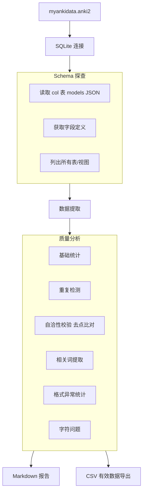

# Anki 数据质量探查方案

## 背景

项目中的 `myankidata.anki2` 是一个 Anki 数据库文件，包含 ~1000+ 条单词词根词缀切分的种子数据（Seed Dataset）。数据来自 Anki 导出，格式为 SQLite 数据库。

从 [`memory-bank/切分规划.md`](memory-bank/切分规划.md:35) 的描述看，这些数据已被描述为"1000+条但是并不干净的数据"，需要清洗和预处理后用于：

1. **规则提炼**：提取已切分好的前缀（`in-`, `bene-`）、后缀（`-ent`, `-ate`）和词根（`vol`, `veter`）
2. **算法校验**：留出测试集检验切分算法的准确性

## 目标

编写一个 Python 脚本 `inspect_anki_data.py`，对 `myankidata.anki2` 进行全方面数据质量探查，输出可读的数据质量报告。最终清洗后的数据只保留第 0 项（单词）和第 3 项（切分数据+相关词）。

---

## 数据结构说明（来自用户提供的示例）

### Anki 笔记字段结构

每条笔记的 `flds` 字段以制表符（`\t`）分隔多个字段。以 `rapture` 为例：

| 索引 | 内容示例 | 含义 |
|------|---------|------|
| **0** | `rapture` | **单词本身** ✅ 最终保留 |
| 1 | `/ˈræptʃə(r)/` | 音标 ❌ 最终丢弃 |
| 2 | `be in ~s about / over sth.` | 搭配短语 ❌ 最终丢弃 |
| **3** | `rap.ture n. 狂喜 en.rap.ture v. 使狂喜 rav.ish v. 使狂喜；多一个"强奸"的意思 rhap.sody 狂想曲 (多个h)` | **切分数据及同根词** ✅ 最终保留（全部内容） |
| 4~6 | 词源/释义等 | 辅助信息 ❌ 最终丢弃 |
| 7 | (空) | ❌ 最终丢弃 |

### 关键判定逻辑（自洽性校验）

1. 从第 3 项开头提取**第一个带点号的切分词**（如 `rap.ture`）
2. 去掉其中的点号 → `rapture`
3. 与第 0 项的单词（`rapture`）比较
4. 如果两者**相同** → **数据有效 ✅**，值得保留
5. 如果**不同**（或第 3 项为空/无点号）→ **整条数据丢弃 ❌**

### 示例

| 第 0 项 | 第 3 项开头 | 去点后 | 判定 |
|---------|------------|--------|------|
| `rapture` | `rap.ture n. 狂喜 ...` | `rapture` | ✅ 有效 |
| `apple` | `ap.ple ...` | `apple` | ✅ 有效 |
| `cat` | `dog ...` | `dog` | ❌ 无效（不匹配） |
| `hello` | （空） | - | ❌ 无效（为空） |

### 最终产出格式

最终清洗后的数据只保留 2 列：

| 第 0 项（单词） | 第 3 项（切分数据，保留全部内容） |
|----------------|----------------------------------|
| `rapture` | `rap.ture n. 狂喜 en.rap.ture v. 使狂喜 rav.ish v. 使狂喜；多一个"强奸"的意思 rhap.sody 狂想曲 (多个h)` |

### 相关词说明

第 3 项中除了主词（第一个）的切分外，还包含其他带点号切分的英文单词（如 `en.rap.ture`, `rav.ish`, `rhap.sody`），这些是用户人工标注的**同根相关词**。探查阶段需要：

- 从第 3 项中提取所有带点号的切分单词
- 统计词频分布
- 未来程序也需要能给出类似的相关词

---

## 技术方案

### 总体架构



### 依赖

- **Python 标准库**：`sqlite3`, `json`, `re`, `collections`, `datetime`, `csv`，**无需第三方依赖**
- **Python 路径**：`.\venv\Scripts\python.exe`（项目已有虚拟环境）

### Anki 数据库结构

Anki 的 `.anki2` 文件是标准 SQLite 数据库，核心表结构：

| 表名 | 用途 | 关键字段 |
|------|------|----------|
| `notes` | 笔记数据（核心） | `id`, `guid`, `mid`, `tags`, `flds`, `sfld`, `mod` |
| `cards` | 卡片实例 | `id`, `nid`, `did`, `ord`, `mod`, `type`, `queue` |
| `col` | 集合配置 | `id`, `crt`, `mod`, `models`(JSON), `decks`(JSON), `dconf`(JSON) |
| `revlog` | 复习记录 | `id`, `cid`, `usn`, `ease`, `ivl`, `lastIvl`, `factor` |
| `graves` | 删除记录 | `usn`, `oid`, `type` |

**核心数据字段**：`notes.flds` 以 **制表符（`\t`）** 分隔存储各字段值，字段顺序由 `col.models` JSON 中的 `flds` 数组定义。

---

## 探查维度详解

### 1. Schema 探查

| 检查项 | 说明 |
|--------|------|
| 表结构 | 列出所有表名、各表字段、类型、索引 |
| Note Model | 从 `col.models` JSON 中解析 note type 定义，获取字段名列表 |
| 字段映射 | 确定 `flds` 中每个制表符分隔值的含义（已知索引 0=单词, 3=切分数据） |

### 2. 基础统计

| 指标 | 计算方法 |
|------|----------|
| 笔记总数 | `SELECT COUNT(*) FROM notes` |
| 卡片总数 | `SELECT COUNT(*) FROM cards` |
| 唯一单词数 | 对第 0 项（单词）去重计数 |
| 字段填充率 | 各字段非空比例（重点关注第 0 项和第 3 项） |
| 标签统计 | 解析 `tags` 字段，统计标签分布 |
| 时间范围 | 从 `mod`（修改时间戳）字段获取数据时间跨度 |
| **有效数据量** | 通过自洽性校验的条目数 |
| **无效数据量** | 未通过自洽性校验的条目数 |
| **有效数据占比** | 有效 / 总数 |

### 3. 自洽性校验（核心逻辑）

| 步骤 | 操作 | 示例 |
|------|------|------|
| 1 | 从第 3 项开头提取第一个带点号的单词 | `rap.ture` |
| 2 | 去掉单词中的所有点号 `.` | `rapture` |
| 3 | 与第 0 项比较（小写不敏感） | `rapture` == `rapture` |
| 4 | 相同 ✅ 有效；不同 ❌ 丢弃 | ✅ |

**正则模式**：
- 提取第一个切分词：`^[a-zA-Z]+\.[a-zA-Z]+(?:\.[a-zA-Z]+)*`
- 去点比对：`re.sub(r'\.', '', seg_word) == word_field0.lower()`

### 4. 重复检测

| 检查项 | 方法 |
|--------|------|
| 完全重复 | GUID 重复或各字段完全一致 |
| 单词级重复（大小写敏感） | 第 0 项完全相同 |
| 单词级重复（大小写不敏感） | 第 0 项小写后相同 |
| 重复分布 | 列出 Top-N 重复最多的单词及出现次数 |

### 5. 相关词提取

从第 3 项中提取所有带点号切分的英文单词：

| 指标 | 说明 |
|------|------|
| 相关词总数 | 提取到的所有带点号单词的总数 |
| 唯一相关词数 | 去重后的相关词数量 |
| 相关词词频分布 | Top-N 出现最多的相关词及其来源主词 |
| 每条的日均有相关词数 | 平均每条有效数据包含几个相关词 |

提取正则：`[a-zA-Z]+\.[a-zA-Z]+(?:\.[a-zA-Z]+)*`

**示例**（对 `rapture` 的第 3 项）：
```
rap.ture          → 主词切分
en.rap.ture       → 相关词
rav.ish           → 相关词
rhap.sody         → 相关词
```

### 6. 格式异常统计

| 异常类型 | 判定规则 |
|----------|----------|
| 第 3 项为空 | `flds` 中第 3 段为空或仅空白 |
| 第 3 项无点号 | 第 3 项有内容但不含 `.` |
| 第 3 项开头非单词 | 第 3 项开头不是字母（如数字、符号开头） |
| 第 3 项去点后不匹配 | 有切分词但与第 0 项不一致 |
| 第 0 项为空 | 单词字段缺失 |

### 7. 字符与编码问题

| 检查项 | 说明 |
|--------|------|
| 不可见字符 | 包含控制字符、零宽字符等 |
| 前后空白 | 字段值首尾空格未 trim |
| 中文混入单词字段 | 第 0 项或切分词中含有中文字符 |
| 大小写不一致 | 同一单词不同大小写写法 |

---

## 输出文件

### 1. Markdown 报告

输出路径：`plains/anki-data-quality-report.md`

```markdown
# Anki 数据质量报告
生成时间: 2026-06-05 10:00:00

## 1. Schema 概览
- 数据库版本: ...
- Note Model 名称: ...
- 字段定义: 字段0:单词 | 字段1:音标 | 字段2:搭配 | 字段3:切分数据 | ...

## 2. 基础统计
| 指标 | 数值 |
|------|------|
| 笔记总数 | 1,234 |
| 卡片总数 | 1,234 |
| 唯一单词数 | 1,200 |
| 有效数据（自洽性校验通过） | 900 (72.9%) |
| 无效数据（自洽性校验未通过） | 334 (27.1%) |
| 数据时间跨度 | 2024-01 ~ 2025-06 |

## 3. 字段填充率
| 字段索引 | 字段名 | 填充数 | 填充率 | 空值数 |
|---------|--------|--------|--------|--------|
| 0 | 单词 | 1234 | 100.0% | 0 |
| 3 | 切分数据 | 1000 | 81.0% | 234 |

## 4. 重复分析
- 完全重复条目: 12
- 单词级重复（大小写敏感）: 15
- 单词级重复（大小写不敏感）: 18

Top-5 重复单词:
| 单词 | 出现次数 |
|------|---------|
| word1 | 5 |
| word2 | 3 |

## 5. 自洽性校验结果
| 结果 | 数量 | 占比 |
|------|------|------|
| ✅ 有效（去点后匹配） | 900 | 72.9% |
| ❌ 第3项为空 | 100 | 8.1% |
| ❌ 第3项无点号 | 134 | 10.9% |
| ❌ 去点后不与第0项匹配 | 100 | 8.1% |

前10条无效数据示例:
| note_id | 第0项（单词） | 第3项（前50字符） | 失败原因 |
|---------|-------------|-----------------|---------|
| 123 | cat | dog ... | 去点后 dog ≠ cat |

## 6. 相关词统计（仅限有效数据）
| 指标 | 数值 |
|------|------|
| 所有相关词总数 | 2,500 |
| 唯一相关词数 | 800 |
| 平均每条有效数据的相关词数 | 2.6 |

Top-10 高频相关词:
| 相关词 | 出现次数 | 来源主词示例 |
|--------|---------|-------------|
| rap.ture | 30 | rapture |
| en.rap.ture | 5 | rapture |
| ... | ... | ... |

## 7. 字符问题
- 含不可见字符条目: 3
- 含首尾空格条目: 5
- 中文字符混入单词字段: 0

## 8. 总结与建议
- 有效数据比例: 72.9%（900条）
- 建议优先处理: 第3项为空的条目 / 第3项无点号的条目
```

### 2. 有效数据 CSV 导出

输出路径：`plains/anki-valid-data.csv`

只包含通过自洽性校验的有效数据，仅 2 列：

```csv
word,segmentation
rapture,"rap.ture n. 狂喜 en.rap.ture v. 使狂喜 rav.ish v. 使狂喜..."
apple,ap.ple ...
```

---

## 脚本文件结构

```
inspect_anki_data.py          # 主脚本，约 350-450 行
```

**代码组织结构**：

```python
#!/usr/bin/env python
"""Anki 数据质量探查脚本"""

import sqlite3
import json
import re
import csv
import os
from collections import Counter, defaultdict
from datetime import datetime

# ─── 配置 ───────────────────────────────────────────────
ANKI_PATH = "myankidata.anki2"
FIELD_COUNT = 8  # 期望的字段数（从示例看有 8 个字段 0-7）
WORD_IDX = 0    # 单词所在字段索引
SEG_IDX = 3     # 切分数据所在字段索引

# ─── 正则 ───────────────────────────────────────────────
# 匹配第3项开头的第一个切分词：如 "rap.ture"
FIRST_SEG_PATTERN = re.compile(r"^([a-zA-Z]+(?:\.[a-zA-Z]+)+)")
# 匹配所有带点号的切分词
ALL_SEG_PATTERN = re.compile(r"[a-zA-Z]+(?:\.[a-zA-Z]+)+")

# ─── Schema 探查 ────────────────────────────────────────
def inspect_schema(conn):
    """探查数据库表结构、Note Model 和字段定义"""
    ...

# ─── 数据提取 ───────────────────────────────────────────
def extract_notes(conn):
    """从 notes 表中提取所有数据，解析 flds 字段"""
    ...

# ─── 基础统计 ───────────────────────────────────────────
def calc_basic_stats(notes):
    """计算条目数、唯一单词数、字段填充率、时间范围"""
    ...

# ─── 自洽性校验 ─────────────────────────────────────────
def check_self_consistency(notes):
    """
    核心判定逻辑：
    1. 取第 3 项开头的第一个切分词
    2. 去掉点号
    3. 与第 0 项比较
    返回 (有效列表, 无效列表, 异常分类统计)
    """
    ...

# ─── 重复检测 ───────────────────────────────────────────
def detect_duplicates(notes):
    """检测完全重复和单词级重复"""
    ...

# ─── 相关词提取 ─────────────────────────────────────────
def extract_related_words(valid_notes):
    """从有效数据第3项中提取所有带点号的切分单词，统计频率"""
    ...

# ─── 格式校验 ───────────────────────────────────────────
def validate_format(notes):
    """校验第3项的格式，分类统计异常"""
    ...

# ─── 字符检查 ───────────────────────────────────────────
def check_characters(notes):
    """检查不可见字符、首尾空格、大小写问题"""
    ...

# ─── 报告生成 ───────────────────────────────────────────
def generate_report(all_stats):
    """生成 Markdown 格式的数据质量报告"""
    ...

# ─── 有效数据导出 ────────────────────────────────────────
def export_valid_data(valid_notes, output_path):
    """只导出第0项和第3项到 CSV"""
    ...

# ─── 主入口 ─────────────────────────────────────────────
def main():
    conn = sqlite3.connect(ANKI_PATH)
    schema = inspect_schema(conn)
    notes = extract_notes(conn)
    
    basic_stats = calc_basic_stats(notes)
    valid_notes, invalid_notes, validity_stats = check_self_consistency(notes)
    duplicates = detect_duplicates(notes)
    related_words = extract_related_words(valid_notes)
    char_issues = check_characters(notes)
    
    report = generate_report({
        "schema": schema,
        "basic": basic_stats,
        "validity": validity_stats,
        "duplicates": duplicates,
        "related_words": related_words,
        "char_issues": char_issues,
    })
    
    os.makedirs("plains", exist_ok=True)
    with open("plains/anki-data-quality-report.md", "w", encoding="utf-8") as f:
        f.write(report)
    
    export_valid_data(valid_notes, "plains/anki-valid-data.csv")
    
    conn.close()
    print(f"[完成] 报告: plains/anki-data-quality-report.md")
    print(f"[完成] 有效数据: plains/anki-valid-data.csv ({len(valid_notes)} 条)")

if __name__ == "__main__":
    main()
```

---

## 执行方式

```bash
.\venv\Scripts\python.exe inspect_anki_data.py
```

输出文件：
- 质量报告：`plains/anki-data-quality-report.md`
- 有效数据：`plains/anki-valid-data.csv`（仅第 0 项 + 第 3 项）

---

## 注意事项

1. **内存安全**：~1000+ 条数据量很小，全量加载到内存即可
2. **编码处理**：Anki 数据是 UTF-8 编码，但注意 `flds` 中的特殊转义
3. **只读访问**：脚本仅读取数据库，不做任何修改
4. **兼容性**：仅使用 Python 标准库，无需额外安装依赖
5. **错误处理**：对无法解析的行要有容错机制，不影响整体统计
6. **字段索引**：字段索引从 0 开始，第 3 项对应 `flds` 按制表符分割后的第 4 个值
