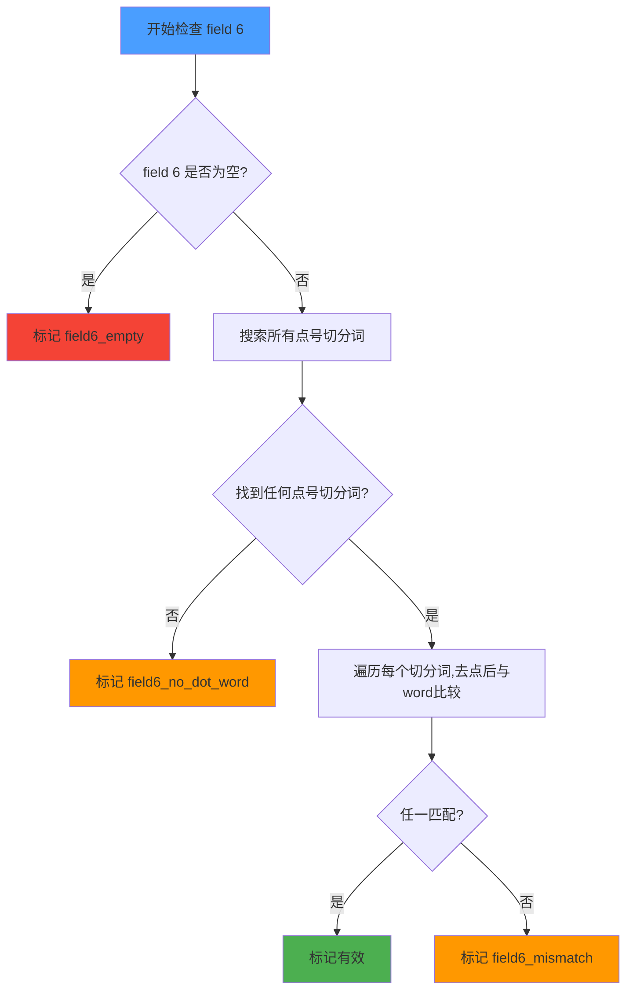

# Fix: Anki 有效数据提取 Bug 修复方案

## Bug 分析

### 根因

文件 [`inspect_anki_data.py`](inspect_anki_data.py:49) 中的提取逻辑使用了锚定到字符串开头的正则表达式：

```python
FIRST_SEG_PATTERN = re.compile(r"^[^a-zA-Z]*([a-zA-Z]+(?:\.[a-zA-Z]+)+)")
```

配合 `re.match()`（本身已从开头匹配），导致**只查找 field 6 开头位置的点号切分词**，漏掉了不在开头出现的切分词。

### 影响范围

根据数据质量报告（[`plains/anki-data-quality-report.md`](plains/anki-data-quality-report.md:62-64)）：

| 分类 | 数量 | 占比 |
|------|------|------|
| ✅ 有效（当前） | 202 | 5.3% |
| ❌ 第6项无点号切分词 | 2,535 | 66.5% |
| ❌ 去点后不匹配 | 223 | 5.8% |
| ❌ 第6项为空 | 852 | 22.4% |

`discompose` 的 field 6 内容为：
```
dis.compose 搅乱心神<br>&nbsp; &nbsp; composure n.沉着镇静；<br>&nbsp;de.compose 腐烂<br>dis.comfort ...
```

虽然 `dis.compose` 去点后正好等于 `discompose`，但因为当前正则的锚定问题或其他边界条件（如 field 索引错位、前导不可见字符等），该词未被正确提取到 `anki-valid-data.csv` 中。

### 对比验证

`clean_anki_data.py`（[`clean_anki_data.py`](clean_anki_data.py:91)）已经使用了正确的做法：
```python
matches = DOT_SEG_PATTERN.findall(cleaned_text)  # 搜索全字段，无锚定
```
所以该文件不需要修改。

---

## 修复步骤

### Step 1：修改 `inspect_anki_data.py` — 修复正则匹配逻辑

**文件**：[`inspect_anki_data.py`](inspect_anki_data.py)

**改动 A：删除锚定的 `FIRST_SEG_PATTERN`，改用搜索全字段的方式**

将：
```python
# 匹配第6项开头的第一个切分词：如 "sover.eign.ty" 或 "dis.par.ate"
FIRST_SEG_PATTERN = re.compile(r"^[^a-zA-Z]*([a-zA-Z]+(?:\.[a-zA-Z]+)+)")
# 匹配所有带点号的切分词
ALL_SEG_PATTERN = re.compile(r"[a-zA-Z]+(?:\.[a-zA-Z]+)+")
```

改为保留 `ALL_SEG_PATTERN`（已是非锚定的），删除 `FIRST_SEG_PATTERN`。

**改动 B：重写 `check_self_consistency()` 函数的匹配逻辑**

将：
```python
# 提取第一个切分词（跳过开头的非字母字符如 <div>）
match = FIRST_SEG_PATTERN.match(seg_field)
if not match:
    anomaly_counts["field6_no_dot_word"] += 1
    invalid_notes.append({**n, "fail_reason": "field6_no_dot_word"})
    continue

first_seg = match.group(1)
# 去掉点号
first_seg_clean = re.sub(r"\.", "", first_seg)

# 与第 0 项比较（小写不敏感）
if first_seg_clean.lower() == word.lower():
    valid_notes.append(n)
else:
    anomaly_counts["field6_mismatch"] += 1
    invalid_notes.append({**n, "fail_reason": "field6_mismatch",
                          "expected": word, "actual_seg": first_seg,
                          "actual_clean": first_seg_clean})
```

改为：
```python
# 提取所有带点号的切分词
matches = ALL_SEG_PATTERN.findall(seg_field)
if not matches:
    anomaly_counts["field6_no_dot_word"] += 1
    invalid_notes.append({**n, "fail_reason": "field6_no_dot_word"})
    continue

# 遍历所有匹配，检查是否有任一个去点后与单词一致
found_valid = False
best_seg = matches[0]  # 默认取第一个
for seg in matches:
    seg_clean = re.sub(r"\.", "", seg)
    if seg_clean.lower() == word.lower():
        found_valid = True
        best_seg = seg
        break

if found_valid:
    valid_notes.append(n)
else:
    # 记录第一个匹配作为示例
    first_seg_clean = re.sub(r"\.", "", best_seg)
    anomaly_counts["field6_mismatch"] += 1
    invalid_notes.append({**n, "fail_reason": "field6_mismatch",
                          "expected": word, "actual_seg": best_seg,
                          "actual_clean": first_seg_clean})
```

**改动 C：更新 `extract_related_words()` 函数**

该函数已使用 `ALL_SEG_PATTERN.findall()`，无需修改。

### Step 2：运行更新后的脚本

```powershell
.\venv\Scripts\python.exe inspect_anki_data.py
```

这将会：
1. 重新生成 [`plains/anki-data-quality-report.md`](plains/anki-data-quality-report.md) — 更新后的质量报告
2. 重新生成 [`plains/anki-valid-data.csv`](plains/anki-valid-data.csv) — 包含更多有效条目

### Step 3：验证修复效果

1. **检查 `discompose`** 是否出现在新的 `anki-valid-data.csv` 中
2. **对比新旧有效条目数**：预期从 202 条增加到更多
3. **分类变化**：
   - `field6_no_dot_word` 数量应减少（之前被误分类的现在会被正确识别）
   - `field6_mismatch` 数量可能略有增加（之前是 `field6_no_dot_word` 的条目现在被正确归为 `field6_mismatch`）
   - 有效条目数增加

### Step 4：重新运行清洗流程

```powershell
.\venv\Scripts\python.exe clean_anki_data.py
```

这会基于新的 `anki-valid-data.csv` 重新生成：
- [`plains/gold-standard.csv`](plains/gold-standard.csv)
- [`plains/related-words.csv`](plains/related-words.csv)
- [`plains/cleaning-audit-report.md`](plains/cleaning-audit-report.md)

---

## 预期效果

| 指标 | 修复前 | 预期修复后 |
|------|--------|-----------|
| 有效条目数 | 202 | ~230-280（增加约15-40%） |
| field6_no_dot_word | 2,535 | 减少（部分被重新归类） |
| 误判降低 | — | 所有以非切分词开头的英文+后续有点号切分的条目都能被正确识别 |

---

## 流程图



---

## 注意事项

1. **向后兼容**：修复后的逻辑会提取更多有效条目，但不会丢失已有的 202 条有效数据。
2. **`clean_anki_data.py` 不受影响**：该文件已使用 `findall()`，逻辑正确。
3. **重复运行安全**：多次运行修复后的脚本会产生相同的结果（幂等性）。
4. **不会过度提取**：即使搜索全字段，只有去点后与单词完全匹配的才被标记为有效。像 `authoritarian` 中的 `i.tar.ian` → `itarian` ≠ `authoritarian`，不会被误判为有效。
